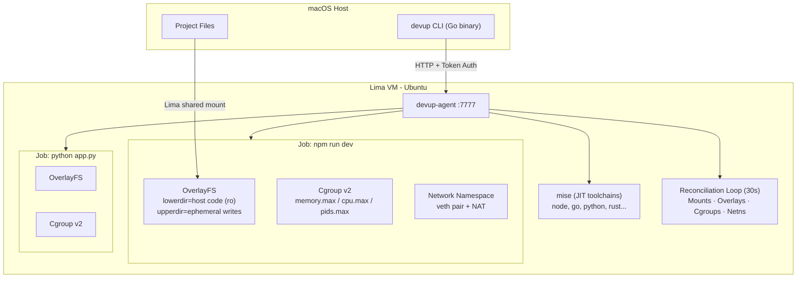

# DevUp

A lightweight container engine for macOS developers. One 15MB Go binary replaces Docker Desktop's 4GB RAM footprint.

DevUp runs your code in a Linux VM with process isolation, filesystem sandboxing, resource limits, and network namespaces — the same kernel primitives that power Docker and Kubernetes — without the overhead.

## Why DevUp?

| | Docker Desktop | DevUp |
|---|---|---|
| Idle RAM | ~2-4 GB | ~150 MB (Lima VM) |
| Binary size | ~1 GB install | ~15 MB |
| Startup | 10-30s | 2-5s |
| Architecture | Daemon + containerd + runc | Single binary + agent |
| Isolation | Full OCI containers | Cgroups v2 + OverlayFS + netns |

DevUp is not a Docker replacement. It's a **development environment engine** — purpose-built for the inner loop of writing, running, and testing code on macOS.

## Architecture



## Quickstart

```bash
brew install lima
go install devup/cmd/devup@latest

devup vm up                    # Start VM + agent (~5s)
devup run -- echo hello        # Run a command
devup dev -f                   # Start Node.js dev server (from project root)
devup start -- python3 app.py  # Background job
devup ps                       # List jobs
devup stop                     # Stop last job
```

## Isolation Primitives

### OverlayFS (Filesystem Sandboxing)

Every job can run with `--overlay` to get a copy-on-write view of your project files. The host code becomes a read-only lower layer; all writes land in an ephemeral upper directory that is destroyed when the job ends. Your Mac's files are never modified.

```bash
devup run --overlay -- npm install    # writes stay in VM, host untouched
devup run --overlay -- rm -rf /       # can't damage host filesystem
```

### Cgroups v2 (Resource Limits)

Pin memory, CPU, and process count per job. Raw writes to `/sys/fs/cgroup/devup/<jobID>/`.

```bash
devup start --memory 512 --cpu 50 --pids 100 -- npm run dev
```

### Network Namespaces (Network Isolation)

Each job can get its own network stack via `--net-isolate`. A veth pair bridges the job's private namespace to the VM, with NAT for internet access. No port collisions between jobs.

```bash
devup start --net-isolate -- python3 -m http.server 8000
devup start --net-isolate -- python3 -m http.server 8000  # same port, different namespace
```

### Combined Isolation

`--isolate` enables OverlayFS + network namespace together — a full sandbox.

```bash
devup start --isolate --memory 256 -- untrusted-script.sh
```

## JIT Toolchain Provisioning

DevUp auto-detects your project's language from marker files and installs the right runtime via [mise](https://mise.jdx.dev/) on first run:

| File | Tool installed |
|---|---|
| `package.json` | node (version from `engines.node` or LTS) |
| `go.mod` | go (version from `go` directive) |
| `requirements.txt` / `pyproject.toml` | python |
| `Cargo.toml` | rust |
| `Gemfile` | ruby |
| `.mise.toml` / `.tool-versions` | Defers to mise native config |

Toolchains are cached in `/opt/devup/mise` and shared across jobs.

## Self-Healing Reconciliation

The agent runs a unified garbage collector every 30 seconds that reconciles four types of kernel objects:

1. **Bind mounts** — scans `/proc/mounts` for orphaned `/workspace` entries
2. **OverlayFS** — prunes `/var/lib/devup/overlay/` dirs without active jobs
3. **Cgroups** — removes `/sys/fs/cgroup/devup/` entries for dead jobs
4. **Network namespaces** — deletes `devup-*` namespaces via `ip netns`

If the agent crashes, every leaked kernel object is cleaned up on restart. The golden rule: **if it doesn't clean up after itself, it's malware.**

## TUI Dashboard

```bash
devup dashboard   # or: devup ui
```

Interactive terminal UI for VM status, job management, log streaming.

| Key | Action |
|---|---|
| `r` | Refresh |
| `enter` | View logs |
| `s` | Stop selected job |
| `a` | Start new job |
| `d` | Stop all jobs |
| `f` | Toggle log follow |
| `q` | Quit |

## CLI Reference

| Command | Description |
|---|---|
| `devup vm up` | Start Lima VM and agent |
| `devup vm down` | Stop VM |
| `devup vm shell` | Open shell in VM |
| `devup vm status` | VM and agent status |
| `devup vm provision` | Install base toolchains |
| `devup vm doctor` | Check toolchain versions |
| `devup run [opts] -- <cmd>` | Run command (ephemeral) |
| `devup start [opts] -- <cmd>` | Start background job |
| `devup ps` | List jobs with limits |
| `devup logs [id] [-f]` | Job logs |
| `devup stop [id]` | Stop job |
| `devup down` | Stop all jobs |
| `devup dashboard` | TUI (alias: `ui`) |
| `devup dev [-f]` | Start Node.js dev server |

**Run/Start flags:** `--mount`, `--workdir`, `--memory`, `--cpu`, `--pids`, `--overlay`, `--net-isolate`, `--isolate`

## How It Works

1. **Lima VM** — Lightweight Ubuntu VM on macOS with shared filesystem via virtio-9p
2. **devup-agent** — Go HTTP server inside the VM (port 7777, token auth) that manages jobs
3. **Process groups** — Every job runs with `Setpgid: true` so `SIGTERM`/`SIGKILL` reliably kills the entire tree
4. **OverlayFS** — `mount -t overlay` with lowerdir (host code) + upperdir (ephemeral) + merged (what the process sees)
5. **Cgroups v2** — Direct writes to `/sys/fs/cgroup/devup/<jobID>/memory.max`, `cpu.max`, `pids.max`
6. **Network namespaces** — `ip netns add` + veth pair + iptables NAT for per-job network isolation
7. **mise** — JIT toolchain provisioning; detects language from workspace files, installs correct runtime
8. **Reconciliation loop** — 30s GC that diffs kernel state against the jobs map and cleans up orphans

## Project Structure

```
cmd/devup/          Host CLI (macOS)
cmd/devup-agent/    Agent (Linux VM)
internal/
  api/              Request/response types
  cgroup/           Cgroups v2 raw filesystem ops
  client/           HTTP client for agent
  config/           Token and config management
  logging/          Structured logging
  mounts/           Mount flag parsing
  netns/            Network namespace lifecycle
  overlay/          OverlayFS mount/unmount/reconcile
  ringbuffer/       In-memory log buffer
  toolchain/        Language detection + mise integration
  tui/              Bubble Tea dashboard
  util/             Shared utilities
  vm/               Lima VM lifecycle
scripts/
  vm-provision.sh   Base toolchain provisioning (embedded via go:embed)
vm/lima/
  devup.yaml        Lima VM configuration
```

## License

MIT
